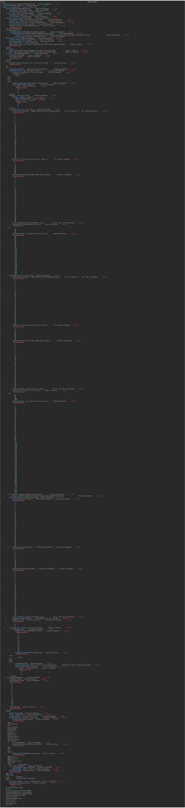

# Ansible Role - wwt.meraki.configure_meraki_mr

## Description

This role is used to configure Meraki MR Access Points

## Using this Role

To use this role, you will need to provide `dashboard_base_url`, `auth_key` and have a variable named `meraki_mr_configuration` that adheres to the following argument spec:



## Example `meraki_mr_configuration` Data Model

```yaml
---
meraki_mr_configuration:
  network:
    organization: ORG NAME
    network: NETWORK NAME
  access_points:
    - name: demo-mr44
      rf_profile_name: Demo-RF-Profile
  access_points:
    - name: demo-mr44
      rf_profile_name: Demo-RF-Profile
  general_settings:
    ipv6_bridge_enabled: true
    led_lights_on: true
    location_analytics_enabled: true
    meshing_enabled: false
    upgrade_strategy: minimizeUpgradeTime
  bluetooth_settings:
    scanning_enabled: true
    beaconing_enabled: false
  rfProfiles:
    - name: Demo-RF-Profile
      state: present
      bandSelectionType: ap
      clientBalancingEnabled: true
      apBandSettings:
        bandOperationMode: dual
        bandSteeringEnabled: true
        bands:
          enabled:
            - 2.4
            - 5
      fiveGhzSettings:
        maxPower: 30
        minBitrate: 12
        minPower: 8
        rxsop: -65
        channelWidth: 80
      transmission:
        enabled: true
      twoFourGhzSettings:
        maxPower: 30
        minBitrate: 12
        minPower: 8
        rxsop: -65
        axEnabled: true
  ssids:
    - name: Meraki-Demo-Client-Network
      number: 0
      state: present
      enabled: true
      visible: true
      availableOnAllAps: true
      authentication:
        authMode: psk
        psk: "CiscoLive!2024"
        encryptionMode: wpa
        wpaEncryptionMode: WPA2 only
      vlan:
        useVlanTagging: true
        defaultVlanId: 20
      ipAssignmentMode: Bridge mode
      lanIsolationEnabled: true
      splashPage: None
    - name: Meraki-Demo-Camera-Network
      number: 1
      state: present
      enabled: true
      visible: true
      availableOnAllAps: true
      authentication:
        authMode: psk
        psk: "CiscoLive!2024!Cameras"
        encryptionMode: wpa
        wpaEncryptionMode: WPA2 only
      vlan:
        useVlanTagging: true
        defaultVlanId: 30
      ipAssignmentMode: Bridge mode
      lanIsolationEnabled: false
      splashPage: None
    - name: Meraki-Demo-Camera-Network2
      number: 2
      state: absent
      enabled: true
      visible: true
      availableOnAllAps: true
      authentication:
        authMode: psk
        psk: "CiscoLive!2023!Cameras"
        encryptionMode: wpa
        wpaEncryptionMode: WPA2 only
      vlan:
        useVlanTagging: true
        defaultVlanId: 30
      ipAssignmentMode: Bridge mode
      lanIsolationEnabled: false
      splashPage: None
```

## Contributors

Nick Thompson <https://github.com/nsthompson>
