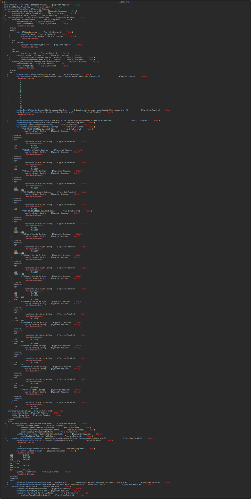

# Ansible Role - wwt.meraki.configure_meraki_mv

## Description

This role is used to configure Meraki MV Security Cameras

## Using this Role

To use this role, you will need to provide `dashboard_base_url`, `auth_key` and have a variable named `meraki_mv_configuration` that adheres to the following argument spec:



## Example `meraki_mv_configuration` Data Model

```yaml
---
meraki_mv_configuration:
  network:
    organization: ORG NAME
    name: NETWORK NAME
  camera_profiles:
    wireless:
      - name: Meraki-Demo-Camera-Profile
        state: present
        ssid:
          authMode: psk
          encryptionMode: wpa
          name: Meraki-Demo-Camera-Network
          psk: "CiscoLive!2024!Cameras"
      - name: Meraki-Demo-Secondary-Camera-Profile
        state: present
        ssid:
          authMode: psk
          encryptionMode: wpa
          name: Meraki-Demo-Client-Network
          psk: "CiscoLive!2024"
    quality_and_retention:
      - name: Meraki-Demo-Quality-Profile
        state: present
        cloudArchiveEnabled: false
        maxRetentionDays: 1
        motionBasedRetentionEnabled: false
        restrictedBandwidthModeEnabled: false
        audioRecordingEnabled: false
        videoSettings:
          MV2:
            quality: high
            resolution: 1920x1080
  cameras:
    - name: demo-mv2
      state: present
      camera_profiles:
        wireless:
          primary: Meraki-Demo-Camera-Profile
          secondary: Meraki-Demo-Secondary-Camera-Profile
        quality_and_retention:
          name: Meraki-Demo-Quality-Profile
      sense:
        senseEnabled: false
        mqttBrokerName: MQTT-Broker
        audioDetection:
          enabled: false
```

## Contributors

Nick Thompson <https://github.com/nsthompson>
