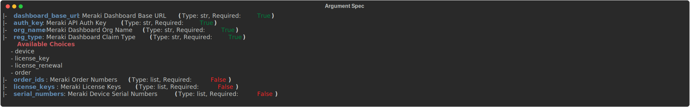

# Ansible Role - wwt.meraki.claim_meraki

## Description

This role is used to claim Meraki Orders, Licenses, and Devices into the Meraki Dashboard

## Using this Role

To use this role, you will need to provide `dashboard_base_url`, `auth_key` and the remaining variables that adhere to the following argpsec:



## Sample Playbook using this role

> :warning: The following playbook example is consuming data provided by an **Ansible Controller Survey**

```yaml
---
- name: Claim Meraki Inventory via Order, Serial Number, or License Key
  connection: local
  hosts: localhost

  tasks:
    - name: Claim Meraki Device
      ansible.builtin.include_role:
        name: wwt.meraki.claim_meraki
      vars:
        serial_numbers: "{{ survey_serial_numbers.split('\n') }}"
        order_ids: "{{ survey_order_ids.split('\n') }}"
        license_keys: "{{ survey_license_keys.split('\n') }}"
```

## Contributors

Nick Thompson <https://github.com/nsthompson>
