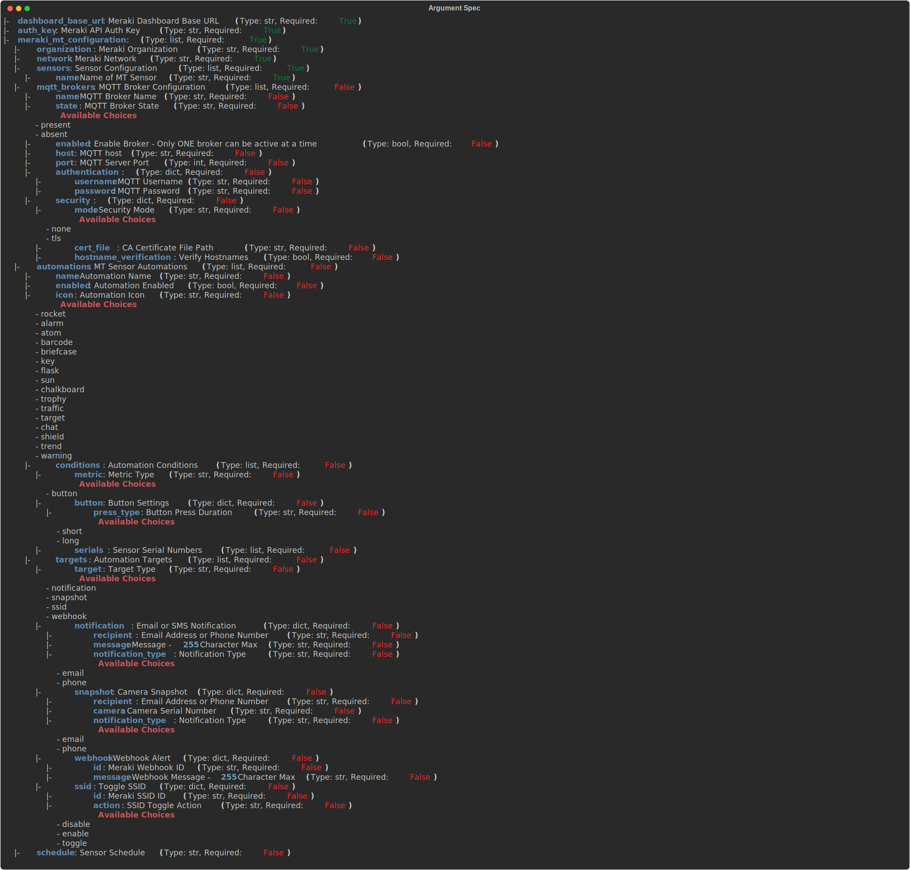

# Ansible Role - wwt.meraki.configure_meraki_mt

## Description

This role is used to configure Meraki MT Sensors

## Using this Role

To use this role, you will need to provide `dashboard_base_url`, `auth_key` and have a variable named `meraki_mt_configuration` that adheres to the following argument spec:



> :warning: **NOTE**
The `automations` dict in the argspec is currently unused as Cisco has not published the API endpoint yet.

## Example `meraki_mt_configuration` Data Model

```yaml
---
meraki_mt_configuration:
  network:
    organization: ORG NAME
    name: NETWORK NAME
  sensors:
    - name: demo-mt30
  mqtt_brokers:
    - name: MQTT-Broker
      state: present
      enabled: true
      host: MQTT HOST
      port: 8883
      authentication:
        username: MQTT USERNAME
        password: MQTT PASSWORD
      security:
        mode: tls
        certFile: 'PATH/TO/MQTTCERT'
        verifyHostnames: false
```

## Contributors

Nick Thompson <https://github.com/nsthompson>
