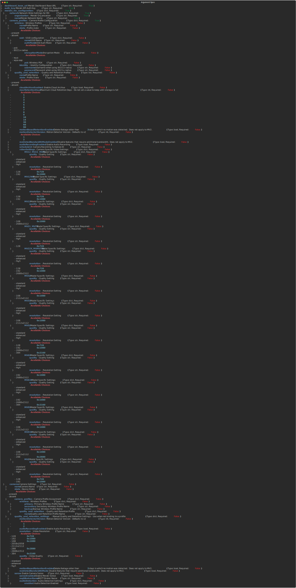

# Ansible Role - wwt.meraki.configure_meraki_mv

## Description

This role is used to configure Meraki MV Security Cameras

## Using this Role

To use this role, you will need to provide `dashboard_base_url`, `auth_key` and have a variable named `meraki_mv_configuration` that adheres to the following argument spec:



## Example `meraki_mv_configuration` Data Model

```yaml
---
meraki_mv_configuration:
  - organization: ORG NAME
    network: NETWORK NAME
    camera_profiles:
      wireless:
        - name: Meraki-Demo-Camera-Profile
          state: present
          auth_mode: psk
          encryption_mode: wpa
          ssid: Meraki-Demo-Camera-Network
          psk: "CiscoLive!2023!Cameras"
        - name: Meraki-Demo-Secondary-Camera-Profile
          state: present
          auth_mode: psk
          encryption_mode: wpa
          ssid: Meraki-Demo-Client-Network
          psk: "CiscoLive!2023"
      quality_and_retention:
        - name: Meraki-Demo-Quality-Profile
          state: present
          cloud_archive: false
          restricted_bandwidth_mode: false
          audio_recording: false
          video_settings:
            MV2:
              quality: high
              resolution: 1920x1080
    cameras:
      - name: demo-mv2
        state: present
        quality_and_retention:
          motion_detector_version: 2
          video_resolution: 1920x1080
          video_quality: high
        wireless:
          profile_1: Meraki-Demo-Camera-Profile
          profile_2: Meraki-Demo-Secondary-Camera-Profile
```

## Contributors

Nick Thompson <https://github.com/nsthompson>
