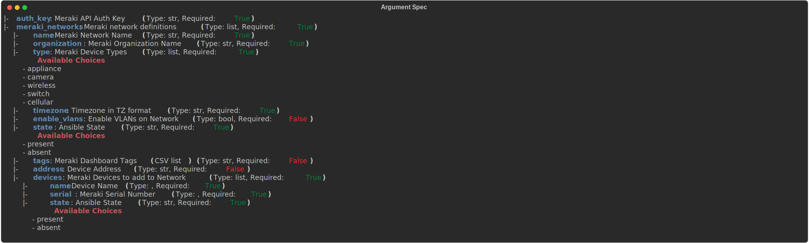

# Ansible Role - wwt.meraki.manage_meraki_network

## Description

This role is used to configure Meraki networks and claim devices into network inventory

## Using this Role

To use this role, you will need to provide `auth_key` and have a variable named `meraki_networks` that adheres to the following argument spec:



## Example `meraki_networks` Data Model

```yaml
---
meraki_networks:
  - name: NETWORK NAME
    organization: ORG NAME
    type:
      - appliance
      - wireless
      - camera
    timezone: America/Chicago
    enable_vlans: true
    state: present
    tags: demo
    devices:
      - name: demo-mx68
        serial: SERIAL
        state: present
      - name: demo-mr44
        serial: SERIAL
        state: present
      - name: demo-mv2
        serial: SERIAL
        state: present
      - name: demo-mt30
        serial: SERIAL
        state: present
    address: SITE ADDRESS
```

## Contributors

Nick Thompson <https://github.com/nsthompson>
